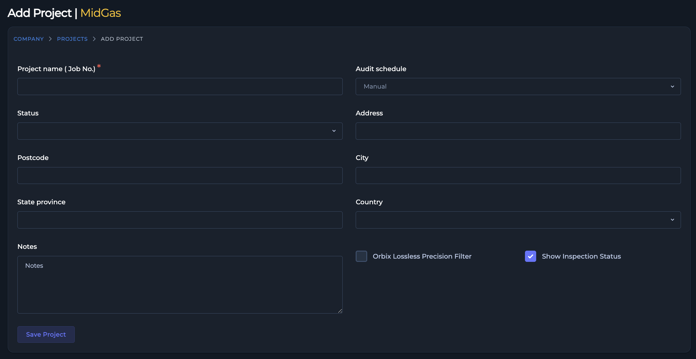
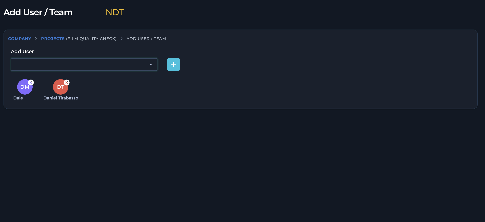

# 4.0 Project & System Administration

This section covers the essential functions for managing projects and system settings within the Orbix software.

## 4.1 Project Management (For Managers)

Managers are responsible for overseeing projects within the Orbix platform. This includes setting up new projects for client companies and managing the team members assigned to each one. Managers have the visibility to view every client and project across the organization.

### 4.1.1 Setting Up a New Project

To create a new project, a Manager must first associate it with a specific company.

1.  From the main company page, select the company for which you are creating the new project.
2.  This will navigate you to that company's **Projects Page**. In the top-right corner, click the **Add Project** button.
3.  The "Add Project" form will open. Complete the required fields:
    * **Project Name**
    * **Status**
    * **Country**
4.  You may also complete several optional fields to provide more detail:
    * **Address**: Add location data for the project.
    * **Notes**: Include any additional information or context pertaining to the project.
    * **Orbix Lossless Precision Filter** (checkbox): Enable this filter to enhance RT images without compromising `DICONDE` data integrity. This unique filter allows you to refine images for different inspection needs or equipment types, revealing critical details while preserving all visual information within the project.
    * **Show Inspection Status** (checkbox): Select this to display the inspection status result on the individual welds for this project.

    {: style="height: 300px"}

    [Screenshot: The "Add Project" form page with required and optional fields.]

5.  After filling in all desired fields, click the **Save Project** button. The project will be saved within the selected company, and you will be redirected back to the **Projects Page**.

### 4.1.2 Managing a Project's Team Members

Once a project is created, Managers can assign users to it and manage the project team.

**Assigning Users to a Project**

1.  On the **Projects Page**, locate the project to which you want to add team members.
2.  In the **Action** column for that project, click the **more options** icon (three dots) and select **Add User/Team** from the menu.
3.  On the **Add User/Team** page, use the **Add user** dropdown menu to select the user you wish to add.
4.  Click the **Add user** button located next to the dropdown. The selected user will be added to the project team.

{: style="height: 300px"}

[Screenshot: The Add User/Team page showing the user dropdown and the list of current team members.]

**Removing Users from a Project**

1.  Navigate to the **Add User/Team** page for the specific project.
2.  Below the user assignment section, you will see a list of all users currently assigned to the project.
3.  To remove a team member, click the **x** button next to the user's name. This action will immediately remove the user from the project, and they will no longer see it on their **Projects Page** dashboard.
