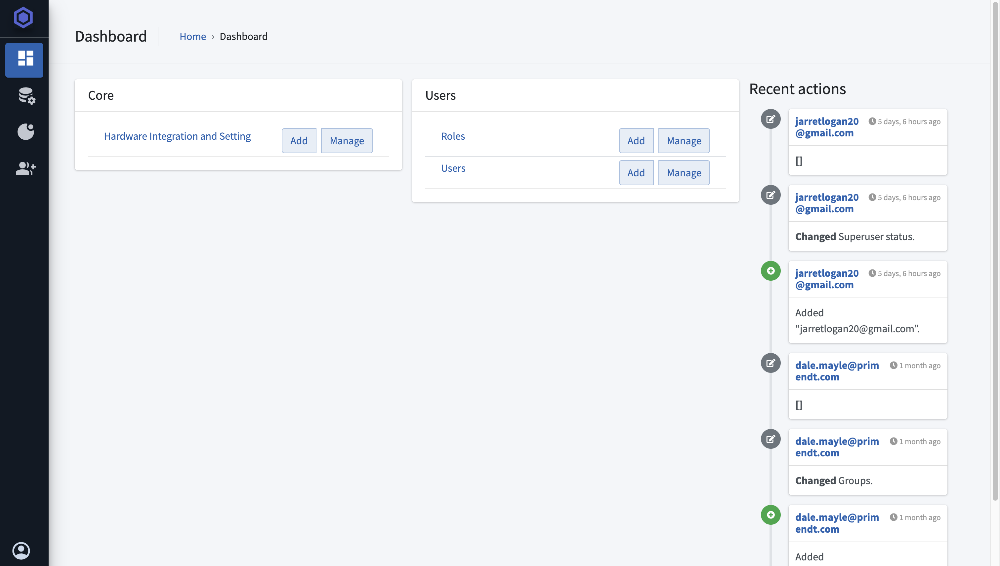

# 4.2 System Administration (The Admin Panel)

## 4.2.1 Accessing the Admin Panel

{: style="height:300px"}

## 4.2.2 Managing Users & Permissions
* Creating new user accounts
<iframe src="https://scribehow.com/embed/Add_a_New_User_in_Orbix_NDE_System__IwN1AZvbSuCUqmRLetH90A?as=video" width="100%" height="800" allow="fullscreen" style="aspect-ratio: 16 / 12; border: 0; min-height: 480px"></iframe>

## Configuring Project Templates & Data Ingestion

