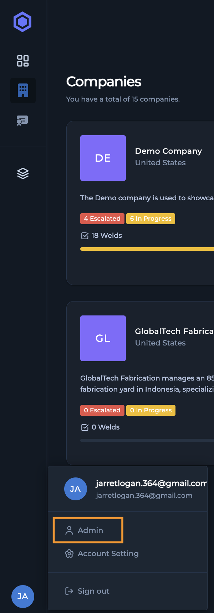
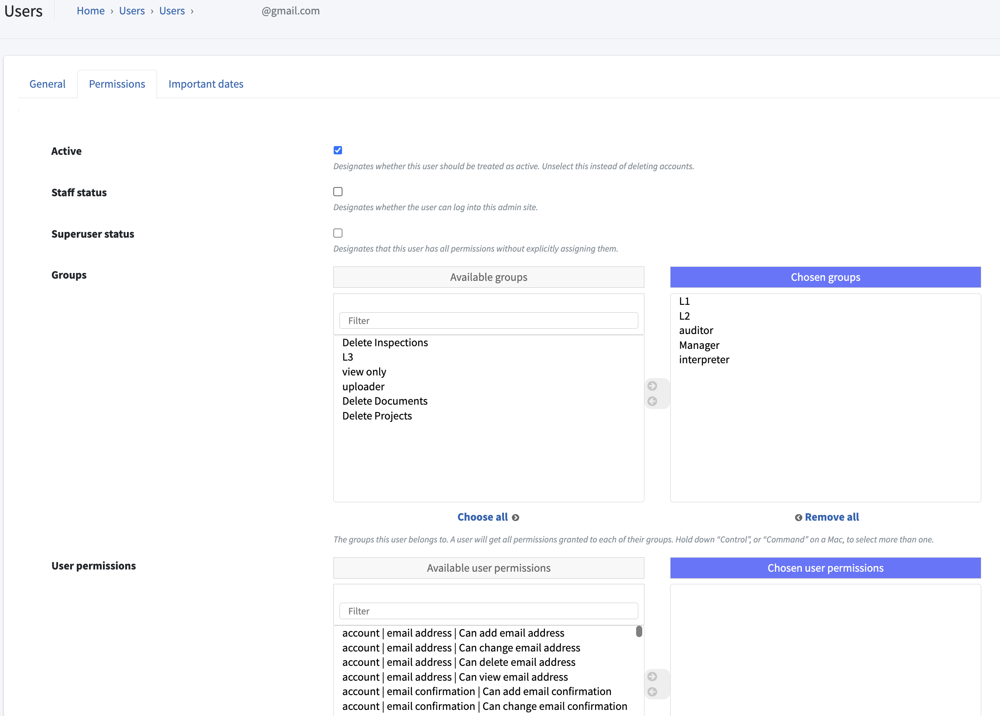
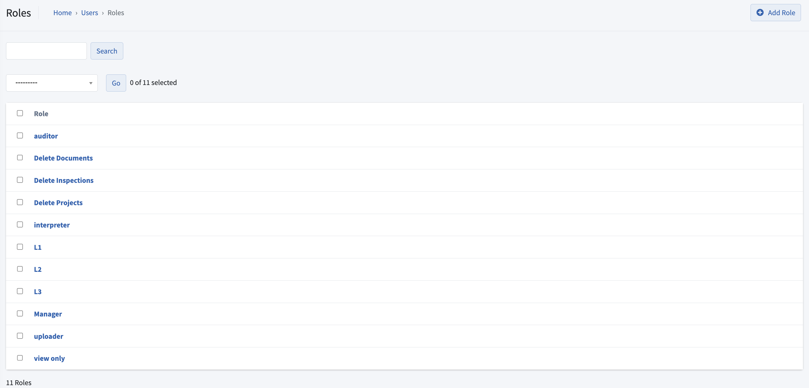
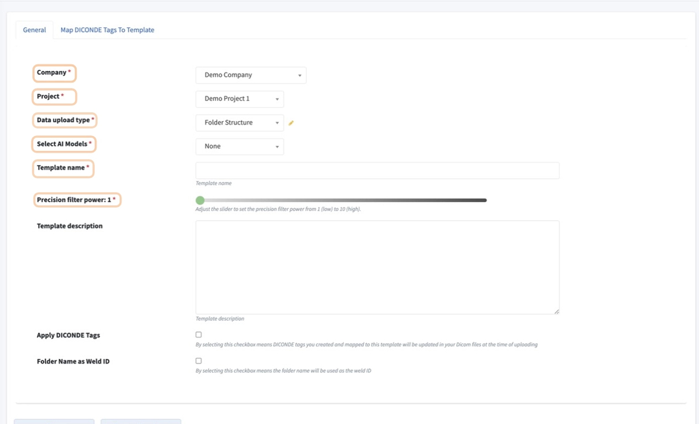
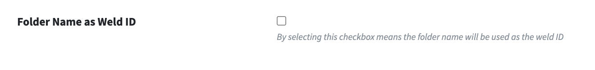

# 4.2 System Administration (The Admin Panel)

The **Admin Panel** is the central hub for system administrators to manage the Orbix environment for their organization. Within this panel, administrators handle user accounts, manage system-wide permissions and roles, and configure project templates and data ingestion settings.

## 4.2.1 Accessing the Admin Panel

Access to the **Admin Panel** is restricted to users with specific permissions.

1.  To access the panel, your user account must have **Staff Status** permission enabled.
2.  If you have the correct permission, click on your profile at the bottom of the main navigation menu.
3.  Select **Admin Panel** from the menu options that appear. You will then be directed to the **Admin Panel** dashboard.

{: style="height: 300px"}

[Screenshot: The main navigation menu with the user profile clicked, showing the "Admin Panel" option.]

## 4.2.2 Managing Users & Permissions

From the **Admin Panel** dashboard, administrators can create and manage all user accounts and their associated access levels.

**Creating New User Accounts**

1.  From the **Admin Panel** dashboard, locate the **Users** section and click the **Add** button.
2.  The **Add User** form will open. Enter the new user's information:
    * **Username** (Required; used for signing in)
    * **Email Address** (Required)
    * **Name of User** (Required)
    * **Phone Number** (Optional)
3.  Click the **Save and Continue** button. This creates the user's account and immediately takes you to the permissions tab to configure their access.

After creating the user, you must assign the necessary permissions.

1.  In the **Permissions** tab for the new user, you can configure their system-wide access. Key permissions include:
    * **Active**: Designates whether this user should be treated as active within Orbix. Inactive users do not appear in system processes.
    * **Staff Status**: Grants the user access to the **Admin Panel**.
    * **Superuser Status**: Grants the user all permissions without needing to assign them individually.
2.  You can also assign users to pre-defined permission groups (e.g., **Technician**, **Auditor**, **Manager**) or assign specific, individual actions.
3.  After configuring the user's permissions, you must click the **Email login details** button on their profile. This sends an email to the user with a link to finish setting up their account and create a password.

{: style="height: 300px"}

[Screenshot: The user permissions tab within the Admin Panel, showing the Active, Staff Status, and Superuser checkboxes.]

**Assigning System-Wide Roles and Permissions**

Administrators can create standardized roles to apply a set of permissions to multiple users quickly.

1.  From the **Admin Panel** dashboard, navigate to the **Roles** (or Groups) section and click the **Add** button.
2.  In the **Add Role** form, enter a name for the role (e.g., Technician) and select all the permissions that users with this role should have.
3.  Click **Save** to create the role. Now you can assign this role to any user.
4.  To manage existing roles, click the **Manage** button in the **Roles** section. The **Roles Dashboard** allows you to edit permissions, rename, or delete any custom role.

{: style="height: 300px"}

**Deactivating or Deleting Users**

When a user no longer requires access to Orbix, an administrator can either deactivate or permanently delete their account. This is done from the **Permissions** tab on the user's page.

* **To Deactivate a User**: Uncheck the **Active** checkbox. This action makes the user inactive, preventing them from appearing in any Orbix processes. It does not delete their account, and their status can be changed back to active at any time.
* **To Delete a User**: Scroll to the bottom of the user's page and click the **Delete** button. This action is permanent and will completely remove the user and their credentials from the system.

## 4.2.3 Configuring Project Templates & Data Ingestion

In the admin panel, a system administrator can configure Project Templates and Data Ingestion settings. These templates are crucial as they define how **Orbix** projects behave when ingesting various types of data from the **Batch Upload and Real-Time Upload**.

***

### Creating Hardware Integration Templates

Hardware integration templates connect **Orbix** with various acquisition systems and standardize the data upload process.

To create a new template, navigate to the admin panel and click **Add** next to the **Hardware Integration and Setting** label. This action opens the **Add data template** page.

{: style="height: 300px"}

[Screenshot: The 'Add data template' page with fields highlighted.]

Complete the following fields to configure the template:

**Required Fields:**

* **Company:** The company the project belongs to.
* **Project:** The specific project where the template will be used.
* **Data Upload Type:** Defines the **DICONDE** data rules (see below).
* **Select AL Models:** Assigns the relevant AI models for analysis.
* **Template Name:** A unique and descriptive name for the template.
* **Precision Filter power:** Sets the intensity of the image enhancement filter (1-10).

**Optional Fields:**

* **Template description:** A brief explanation of the template's purpose.
* **Apply Diconde Tags:** When enabled, **DICONDE** tags that you have mapped to this template will be updated in your files upon upload.
* **Folder Name as Weld ID:** When enabled, the folder name is automatically used as the **Inspection ID**.

After filling in the desired fields, select **Save and Continue**. The saved template can now be used for both **Batch** and **Real-time** file uploads.

***

### Configuring DICONDE Data Rules

When creating a template, you must select a **Data Upload Type**. This setting tells **Orbix** how to interpret the metadata associated with your **DICONDE** files. There are two distinct rules:

* **Folder Structure:** Select this option if your metadata is organized within the folder hierarchy. **Orbix** will read the folder structure to interpret the data.
* **Trusted Data:** Select this option when the **DICONDE** file itself contains complete and accurate metadata. **Orbix** will trust and read the metadata directly from the file.

***

### Enabling Automatic Inspection ID Generation

To streamline data uploads, you can enable automatic **Inspection ID** generation.

In the template configuration, select the **Folder Name as Weld ID** checkbox. When this feature is active, any batch upload using this template will automatically use the name of the data folder as the **Inspection ID**. This significantly speeds up the upload and audit process in the **Compliance Hub**.

If this feature is disabled, the **Inspection ID** will not be set automatically during a batch upload. You will need to manually assign an **Inspection ID** to each individual weld later. Maintaining a consistent and logical folder naming convention is critical for leveraging this feature effectively.

{: style="width: 300px"}

[Screenshot: The 'Folder Name as Weld ID' checkbox within the template settings.]

***

### Enabling the 'Precision Filter'

The **Precision Filter** is an automatic filter in **Orbix** designed to enhance radiographic testing (RT) images. It improves the signal-to-noise ratio, highlights critical features, and facilitates more accurate analysis without compromising the integrity of the original data.

Within the data template settings, you can set the **Precision Filter power** on a scale from **1 (low)** to **10 (high)**. This value determines the degree of enhancement applied to the RT images. All visual information from the original image is preserved, ensuring that no data is lost during the enhancement process.

