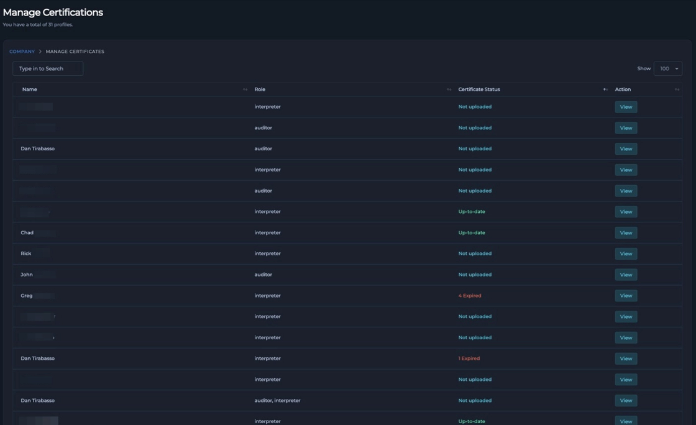

# 3.5 Using the Certifications Module

The **Certifications Module** in Orbix is a centralized system for administrators to input, manage, and track all employee certifications. This module is designed to handle qualifications for various NDT methods (e.g., RT, UT, PT, MT), vision tests, and any other credentials required by your company.

By maintaining a comprehensive record of all qualifications, the module provides critical insights into upcoming expiration dates, expired certifications, and any missing credentials. This ensures your team remains compliant and simplifies the entire certification management process.

{: style="height: 300px"}

## 3.5.1 Viewing Certifications on User Profiles

You can access a user's certification records through two primary methods in Orbix.

**Method 1: Via the Certifications Menu**

1.  Navigate to the main **Certifications** item in the navigation menu. This will display a list of all employees.
2.  Locate the desired employee in the table.
3.  Click the **View** button in the **Action** column to open that employee's complete certification list.

**Method 2: Via the Main Data Manager**

1.  Navigate to the **Main Data Manager**.
2.  In the main data table, locate an `Inspection ID` associated with the user you wish to view.
3.  Click on the user's name in the `Radiographer` column. This will take you directly to their user profile, which includes their certification dashboard.

{: style="height: 300px"}

[Screenshot: An employee's certification list showing active, expiring, and expired credentials.]

## 3.5.2 How to Upload, Manage, and Track Certifications

Administrators can easily add, update, and remove certifications directly from a user's profile page.

**Uploading a New Certification**

1.  Navigate to the employee's user profile using one of the methods described above.
2.  Scroll to the bottom of the page to find the certification upload section.
3.  Fill in the required fields:
    * **Certificate Title**: Enter the official name of the certification.
    * **Expiration Date**: Select the date the certification expires.
    * **File Input**: Click to upload a PDF copy of the certificate.
4.  To add multiple certificates in a single session, click the **Add another** button and fill in the fields for each additional certificate.
5.  Once all fields for all new certificates are complete, click the **Save Certificates** button to add them to the user's profile.

{: style="height: 300px"}

[Screenshot: The certification upload section on a user's profile, showing the Title, Expiration Date, and file input fields.]

**Managing Existing Certifications**

To remove a certification that is no longer valid or was added in error:

1.  Navigate to the employee's certification list.
2.  Locate the certification you need to remove.
3.  Click the red trash can icon next to the certificate entry to permanently delete it.
