# 3.1 Using the Orbix RT Viewer

The Orbix RT Viewer is the dedicated tool for viewing and analyzing the `DICONDE` file for each weld inspection within a project. It is a comprehensive interface that provides all the necessary tools for in-depth analysis, annotation, and reporting to make accurate audit decisions.

## 3.1.1 Interface Overview

The RT Viewer is organized into several key sections to provide an efficient workflow.

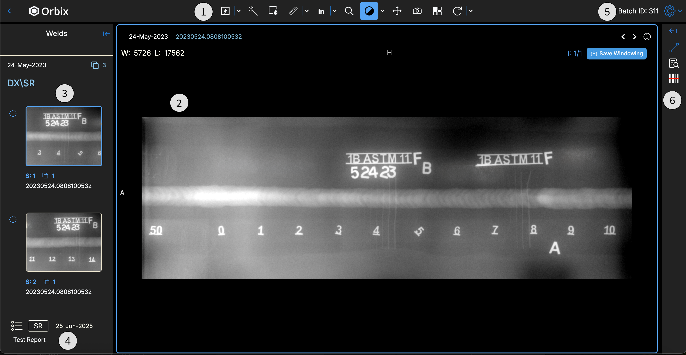{: style="height: 300px"}

* **1. Measurement, Viewing, and Analysis Tools**: A toolbar containing all the features required to interpret the inspection image.
* **2. Viewing Window**: The central area where the `DICONDE` image of the weld is displayed.
* **3. Weld List per Weld ID**: Allows the user to navigate between individual shots associated with a single `Inspection ID`.
* **4. Auditor Structured Report List**: Displays all previously created and saved reports for the active inspection.
* **5. Settings**: Provides options to change the language and configure keyboard shortcuts.
* **6. Auditor Panel**: A side panel that shows measurements taken, allows for labeling, and displays audit decisions between the initial inspection and the final audit.

## 3.1.2 Using Analysis Tools

The RT Viewer includes a powerful set of tools to help you interpret the weld inspection data accurately.

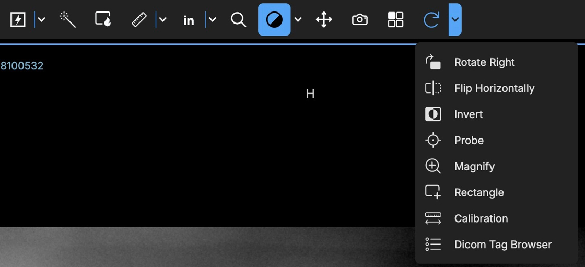{: style="height: 300px"}

[Screenshot: The analysis tools toolbar within the Orbix RT Viewer.]

* **Enhancement**: Adjust the brightness and contrast of the image to improve the visibility of the weld.
* **Focus Filter**: Apply a specialized filter to enhance the visibility of potential defects such as cracks, voids, or inclusions.
* **Length**: Measure the precise size of any defects or features on the weld.
* **Annotation Tool**: Add text labels directly onto the image to clarify findings or highlight specific aspects of the weld.
* **Probe Tool**: View the pixel density of any specific point on the weld image.
* **Rectangle Tool**: Draw a rectangle over an area of interest. The tool provides the height, width, and the minimum and maximum density values for the selected area.
* **Calibration Tool**: Calibrate the **Length** tool against a known reference to ensure all measurements are accurate.

## 3.1.3 Saving & Exporting

After performing your analysis, you can save your findings as a structured report.

**Creating and Saving a Report**

1.  After using the analysis tools to add measurements or annotations, Orbix will prompt you to create a report. Select **Yes** to save the work you have done on the viewing window.
2.  Once in report mode, you can continue to add more measurements or annotations.
3.  Open the **Auditor Panel** and navigate to the **Measurements** tab. Here you will see a list of all measurements and annotations you have created. You can select each one to add a descriptive label.
4.  When you are finished, scroll to the bottom of the **Measurements** tab and click the **Create Report** button.
5.  You will be prompted to name the report. After naming it, click **Save**.
6.  The new report will be added to the **Auditor Structured Report List** within the RT Viewer.

**Editing and Exporting a Report**

You can edit or export any saved report.

1.  From the **Auditor Structured Report List**, open the report you wish to modify or export.
2.  A prompt will appear. Select the option to continue editing the report.
3.  To export the report, open the **Auditor Panel** and go to the **Measurements** tab.
4.  Click the **Export** button.
5.  The report will download as a CSV file, ready for use outside of the Orbix platform.

<!-- ## Interface Overview

| Number | Name | Function | Component |
| :-------: | :-----: | :-----: | :------: |
| 1 | Viewer Tools | Viewing, measurement, & analysis tools to aid in inspecting welds | 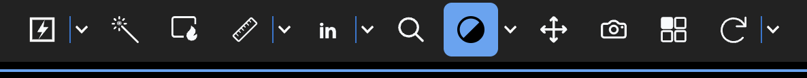{: style="width: 300px"} |
| 2 | DICONDE Viewing Window | DICONDE viewing window for user to see and inspect file | {: style="height: 100px"} |
| 3 | Weld List | View Welds within a single Weld ID | 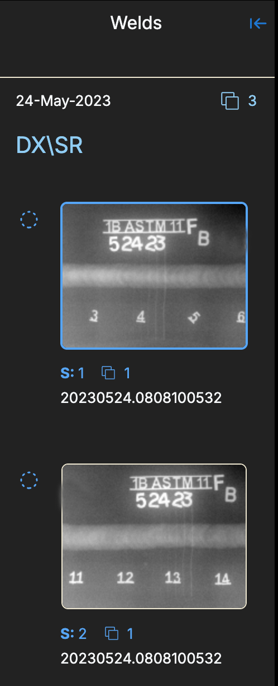{: style="height: 100px"} |
| 4 | Structured Report List | Shows the list of structed reports that have been created for Weld ID | 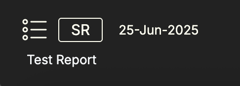{: style="height: 100px"} |
| 5 | Preference Settings | Dialog to change settings such as language and keyboard shortcuts | 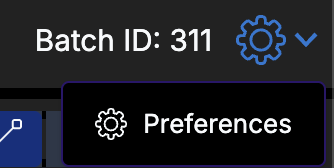{: style="height: 100px"} 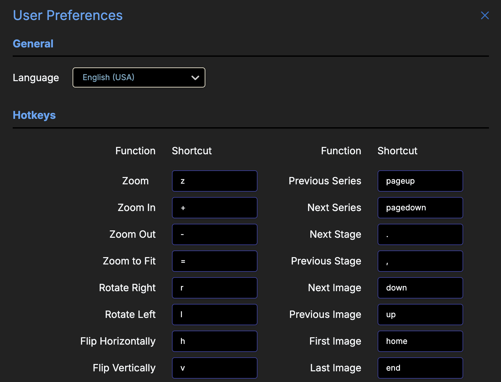{: style="height: 100px"} |
| 6 | Auditing Panel | Panel to make auditing decisions, and view measurements within reports when open | 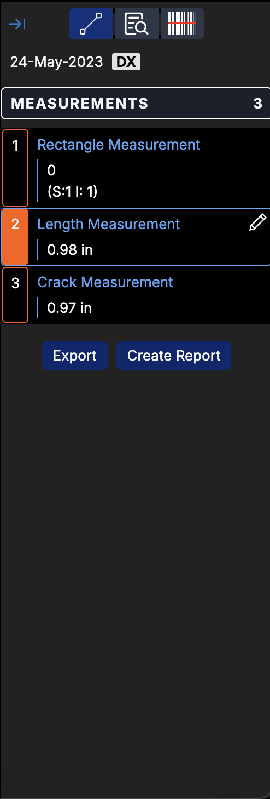{: style="height: 100px"} 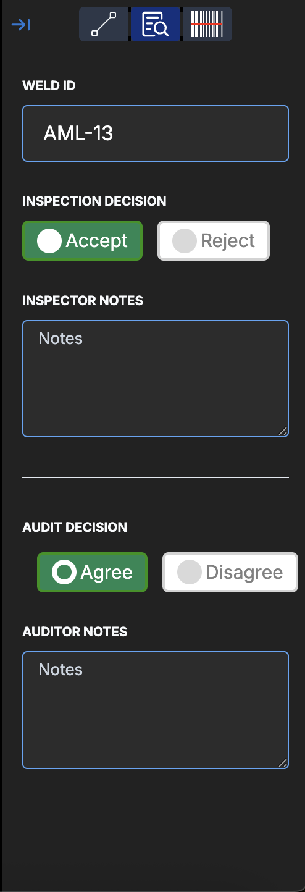{: style="height: 100px"} |

## Using Analysis Tools

| Tool | Function | Component |
| :-----: | :-----: | :------: |
| Enhancement | Adjusts brightness and contrast to improve weld visibility |  |
| Focus Filter | Applys filter to enhance visibility of defects like cracks, voids, or inclusions |  |
| Length | Tool for measuring defect sizes | 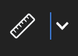 |
| Probe | Tool is used to find pixel density of certain section of weld  |  |
| Rectangle | Tool is used to place a rectangle within the weld. It provides height, width, min, and max density vaules for the area selected |  |
| Calibration | Tool is used to calibrate the length tool to ensure accurate measurements | 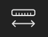 |

## Saving & Exporting

<iframe src="https://scribehow.com/embed/How_To_Create_and_Export_a_Report_Online__4L1N6FB_TvulC6tE8pvgLQ?as=video" width="100%" height="800" allow="fullscreen" style="aspect-ratio: 16 / 12; border: 0; min-height: 480px"></iframe>

<iframe src="https://scribehow.com/embed/How_To_Create_and_Export_a_Report_Online__4L1N6FB_TvulC6tE8pvgLQ?as=scrollable" width="100%" height="800" allow="fullscreen" style="border: 0; min-height: 640px"></iframe> -->