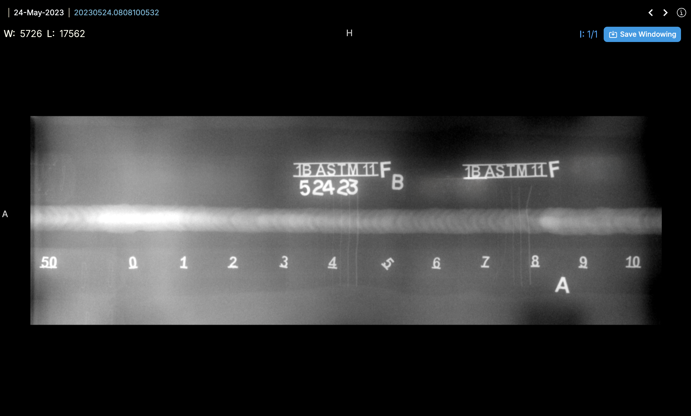

# Using the Orbix RT Viewer

## Interface Overview

| Number | Name | Function | Component |
| :-------: | :-----: | :-----: | :------: |
| 1 | Viewer Tools | Viewing, measurement, & analysis tools to aid in inspecting welds |  |
| 2 | DICONDE Viewing Window | DICONDE viewing window for user to see and inspect file |  |
| 3 | Weld List | View Welds within a single Weld ID |  |
| 4 | Structured Report List | Shows the list of structed reports that have been created for Weld ID |  |
| 5 | Preference Settings | Dialog to change settings such as language and keyboard shortcuts |   |
| 6 | Auditing Panel | Panel to make auditing decisions, and view measurements within reports when open |   |

## Using Analysis Tools

| Tool | Function | Component |
| :-----: | :-----: | :------: |
| Enhancement | Adjusts brightness and contrast to improve weld visibility |  |
| Focus Filter | Applys filter to enhance visibility of defects like cracks, voids, or inclusions |  |
| Length | Tool for measuring defect sizes |  |
| Probe | Tool is used to find pixel density of certain section of weld  |  |
| Rectangle | Tool is used to place a rectangle within the weld. It provides height, width, min, and max density vaules for the area selected |  |
| Calibration | Tool is used to calibrate the length tool to ensure accurate measurements |  |

## Saving & Exporting

<iframe src="https://scribehow.com/embed/How_To_Create_and_Export_a_Report_Online__4L1N6FB_TvulC6tE8pvgLQ?as=video" width="100%" height="800" allow="fullscreen" style="aspect-ratio: 16 / 12; border: 0; min-height: 480px"></iframe>

<iframe src="https://scribehow.com/embed/How_To_Create_and_Export_a_Report_Online__4L1N6FB_TvulC6tE8pvgLQ?as=scrollable" width="100%" height="800" allow="fullscreen" style="border: 0; min-height: 640px"></iframe>