# 2.2 Navigating & Managing Data

## 2.2.1 The Projects Page: Your Central Hub
The Projects page in Orbix serves as your central repository for all projects associated with your company. This dashboard provides a comprehensive overview of each project, displaying critical information and enabling various actions.

### 2.2.1.1 Understanding the Project Table
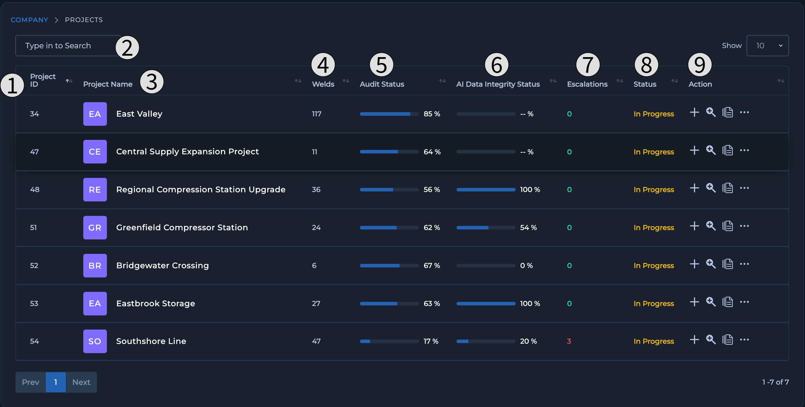{: style="width:475px"}

| Number | Name | Function | Component |
| :-------: | :-----: | :-----: | :------: |
| 1 | Project ID Column | Shows the Project ID used by Orbix to track information on project  | 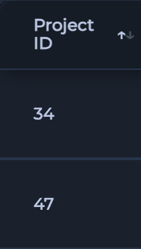 |
| 2 | Search Input | Input to allow user to perform a search on all their projects within a single company | 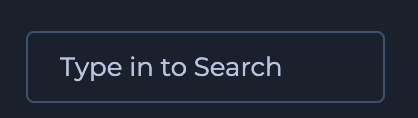 |
| 3 | Project Name Column | Shows name of project given by user | 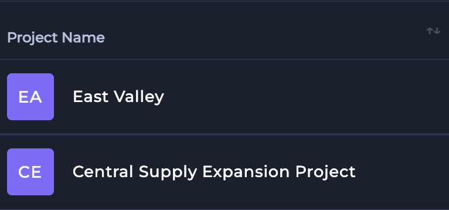 |
| 4 | Welds Column | Shows the number of welds uploaded to a given project | 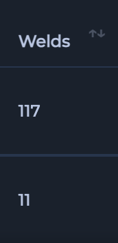 |
| 5 | Audit Status Column | Shows the percentage of welds that have been audited and given an accepted status | 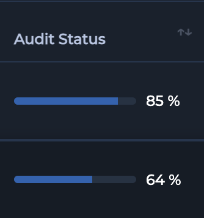 |
| 6 | AI Data Integrity Status Column | Shows the percentage of welds that have passed the AI Data Integrity Audit | 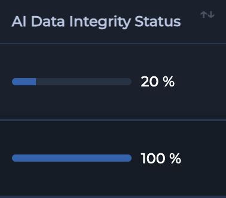 |
| 7 | Excalations Column | Shows the number of Welds that the AI Data Integrity System has flagged as neeeding to be addressed | 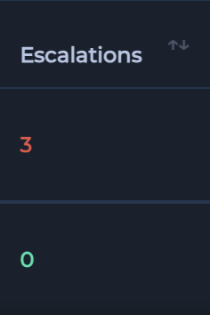 |
| 8 | Status Column | Shows the current status of the project | 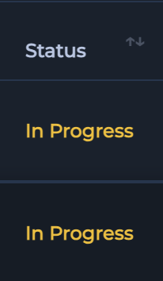 |
| 9 | Action Column | Shows the user the actions that they are able to perform on a certain project | 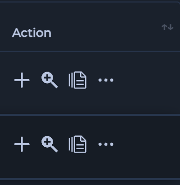 |

### 2.2.1.2 Project Action Icons
From the Projects page, you can perform several critical actions to manage your projects effectively:

| Action | Function | Component |
| :-----: | :-----: | :------: |
| Upload Data | Link to the add data dashboard to upload welds to project via Batch or Real-Time Upload |  |
| Auditors Page | Link to the Audit Dashboard to view information on weld status and perform audit on individual welds or run AI Audit.  |  |
| Compliance Hub | Link to Compliance Hub to view or upload documents for project |  |
| Manage Team | Dashboard to Add or Remove Users from selected project  |  |
| Download Data | Download full project including documentation |  |
| All Notifications | View Notifications for user based on project |  |
| Edit Project | Edit Project information such as (name, audit schedule, status, location information, Lossless Precision Filter, inspection status and notes) |  |
| Delete Project | Deletes Entire Project |  |

## 2.2.2 The Main Data Manager

The **Main Data Manager** is your primary interface within Orbix for interacting with individual welds and their corresponding **DICONDE** files inside a specific project. It provides powerful tools for searching, viewing, and managing every inspection record.

***

### 2.2.2.1 Interface Overview

The **Main Data Manager** is designed for efficient data navigation and management. The interface is centered around three main components: a comprehensive search bar for granular queries, intuitive filters for batch searching, and a detailed data table that lists every weld.

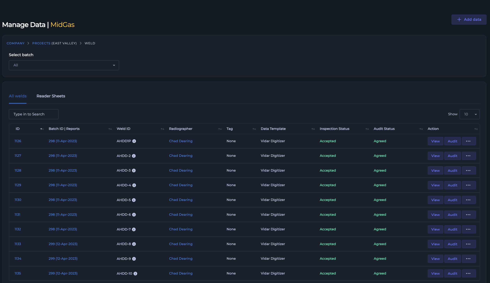{: style="height: 300px"}

[Screenshot: The Main Data Manager interface showing the search bar, filters, and the main data table.]

***

### 2.2.2.2 Understanding the Data Table

The data table lists each individual weld as a unique row, providing critical information in distinct columns. Understanding these columns is key to managing your inspection workflow.

* **ID:** The unique **Inspection ID** for the weld. Clicking on the **ID** opens the **Inspection History**, providing a complete traceability log of every action and status change performed on that specific weld.
* **Batch ID:** The identifier for the batch the weld was uploaded in. Clicking on the **Batch ID** takes you to the manage data page for that entire batch.
* **Weld ID:** The specific identifier for the physical weld.
* **Radiographer:** The name of the technician who performed the inspection. Clicking on a radiographer's name will navigate you to their certifications page within the **Compliance Hub**.
* **Tags:** Any custom tags added for categorization or filtering.
* **Data Template Used:** The specific data template applied to the inspection.
* **Inspection Status:** The finding as determined by the technician (e.g., Pass, Fail, Indication).
* **Audit Status:** The final finding as determined by the auditor. This column allows you to directly compare the initial technician finding with the final audit decision.
* **Actions:** A menu of available operations for each weld.

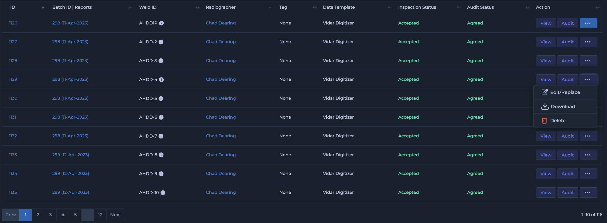{: style="height: 300px"}

[Screenshot: The Main Data Manager data table with columns like Inspection Status, Audit Status, and the clickable ID and Radiographer cells highlighted.]

***

### 2.2.2.3 Powerful Search Tools

Locating specific data within a large project is simple with the **Main Data Manager's** robust search capabilities.

#### Comprehensive Search

Use the main search bar to perform a **Comprehensive Search** across any field in the data table. You can instantly find data by **Inspection ID**, **Weld ID**, radiographer name, or even a specific filename associated with the **DICONDE** data. Simply type your query into the search bar and the table will update in real-time.

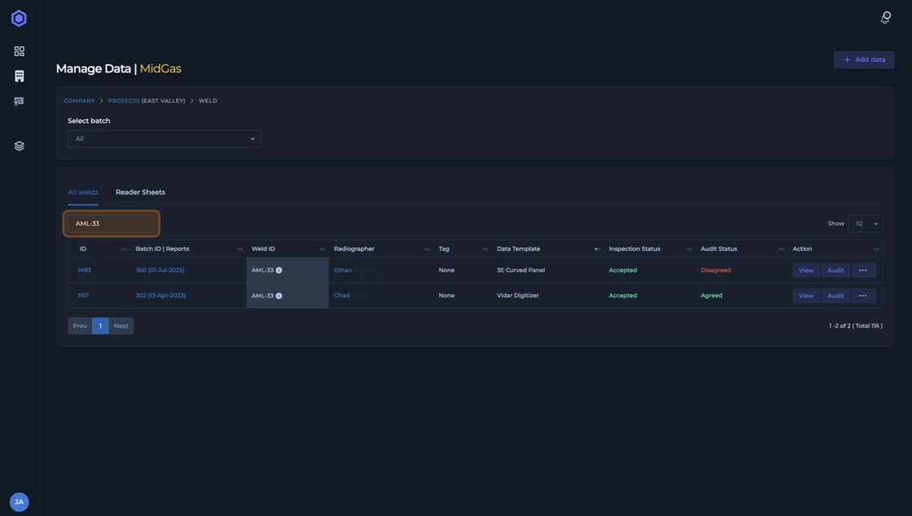{: style="height:300px"}

#### Search by Batch

To find all data associated with a specific upload, use the intuitive **Search by Batch** dropdown filters.

1.  Select a **Date** or **Technician** from the dropdown menus.
2.  The data table will display every weld included in the selected batch.
3.  After selecting a batch, an **Edit** icon appears next to the filter. Click this icon to navigate to the manage data page for that batch, where you can upload additional **DICONDE** files or reader sheets.

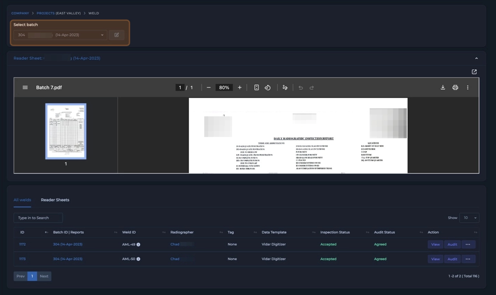{: style="height: 300px"}

***

### 2.2.2.4 Actions

You can perform several actions directly on individual welds or batches from the data table.

From the **Actions** column on any given row, you can:

* **View DICONDE file:** Open the viewer for the associated **DICONDE** file.
* **Audit Individual Weld:** Go directly to the audit page for that weld.
* **Edit or Replace DICONDE files:** Modify or substitute the data files for that weld.
* **Download Single Weld:** Download the complete data package for a single **Inspection ID**.
* **Delete Weld:** Remove the weld record from the project.

