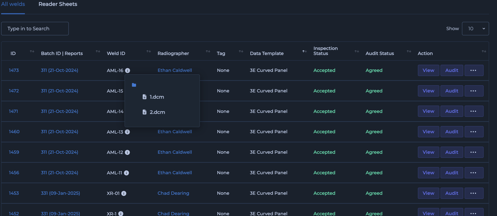
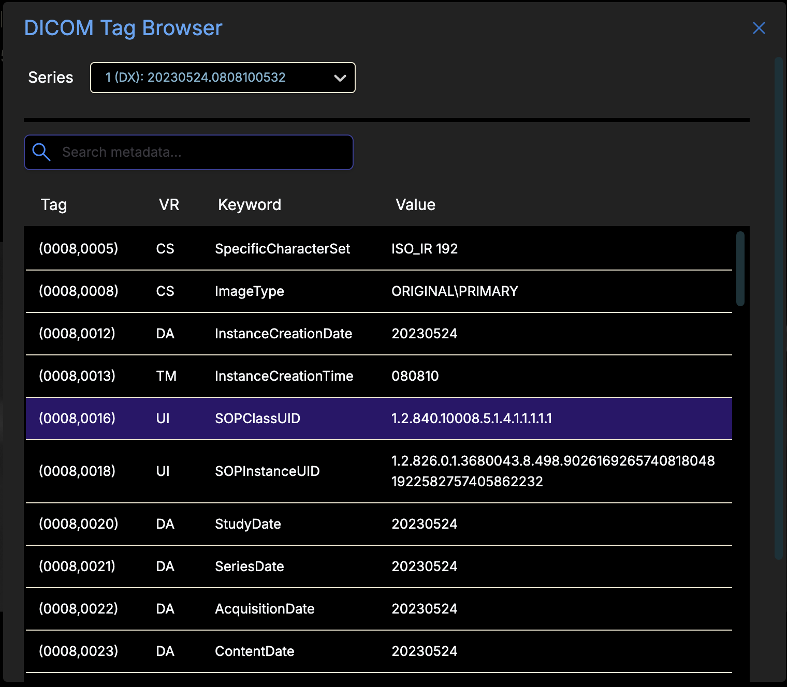
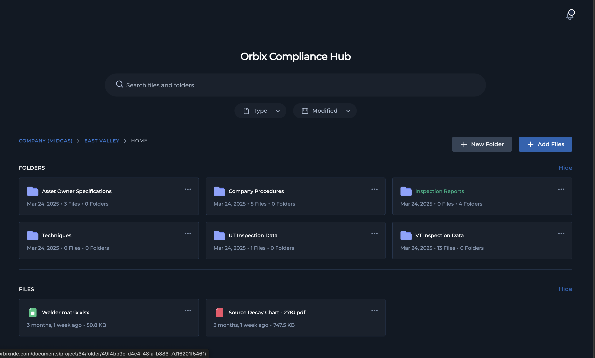
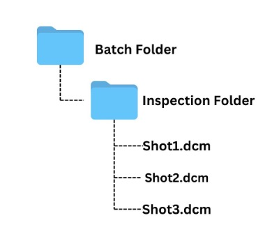
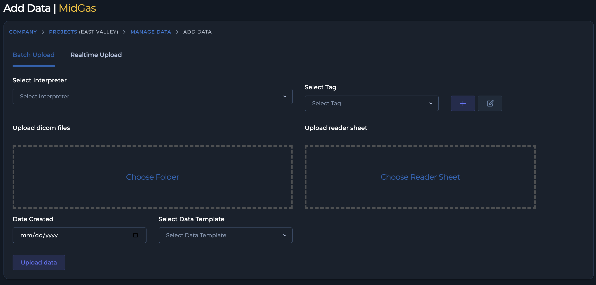

# 2.1 Uploading & Submitting Data

## 2.1.1 Understanding Data Types in Orbix

Orbix primarily utilizes the DICONDE (Digital Imaging and COmmunications in Non-Destructive Evaluation) standard for managing all RT data. DICONDE is an extension of the DICOM (Digital Imaging and COmmunications in Medicine) standard, tailored specifically for NDT applications. This ensures comprehensive, standardized storage of RT images and associated metadata.

When you perform an RT inspection using Orbix, all acquired images, along with critical inspection parameters, technician details, and part information, are encapsulated within the DICONDE file format. This integration ensures data integrity and traceability.

To access RT data within Orbix:

    1. Navigate to the Main Data Manager.

    2. Locate the relevant Inspection ID.

    3. Click "View" button to open the inspection details. You will find all associated DICONDE files with the selected Weld ID.

{: style="width:475px"} {: style="height:300px"}

### Why DICONDE Matters

The Digital Imaging and Communication in Non-Destructive Evaluation (DICONDE) standard is a pivotal framework in the world of Non-Destructive Testing (NDT). It extends the DICOM standard, widely recognized in medical imaging, to NDT applications, ensuring that data from various inspection methods can be universally accessed, shared, and stored. DICONDE files, identifiable by their .dcm extension, encapsulate both the visual data from inspections (such as images) and vital metadata. This standardization is crucial for maintaining data integrity, ensuring compatibility across different equipment, and facilitating secure and reliable storage and analysis.

* **` Universal Compatibility `**: DICONDE ensures seamless data sharing across all NDT systems, eliminating the need for custom solutions and enhancing workflow efficiency. Using DICONDE guarantees your data is saved in a universal format, preventing vendor lock-in.

* **` Data Integrity `**: DICONDE rigorously maintains the integrity of inspection data, encompassing both images and their associated metadata. This means the data remains complete and unchanged from capture through final analysis.

* **` Efficient Data Management and Analysis `**: DICONDE simplifies data processing with a standardized format, enabling straightforward management and advanced analysis on platforms like Orbix.

* **` Optimized Storage and Retrieval `**: DICONDE improves how NDT data is organized and accessed, allowing for quick retrieval of vast amounts of information via secure and reliable specialized data servers.

DICONDE standardization is pivotal for enhancing the efficiency, reliability, and scalability of NDT data handling processes.

### Standard File Formats for Other NDT Methods via the Compliance Hub

While Orbix handles RT data in DICONDE, the Compliance Hub serves as a central repository for documentation and reports generated by other NDT methods. This includes a wide array of standard file formats, ensuring that all inspection-related information is accessible from a single, unified location.

The Compliance Hub supports commonly used file formats, enabling a comprehensive overview of an asset's inspection history, regardless of the NDT method employed.

Common file formats you will encounter in the Compliance Hub include:

* **`PDF (Portable Document Format) `**: Widely used for reports, certifications, and procedure documents due to its universal compatibility and preservation of formatting.

* **` JPG/JPEG (Joint Photographic Experts Group) `**: Often used for visual documentation, such as photographs of surface indications from Visual Testing (VT) or Magnetic Particle Testing (MT).

* **` PNG (Portable Network Graphics) `**: Similar to JPG, PNG offers lossless compression and supports transparency, making it suitable for diagrams or images requiring higher fidelity.

* **` TIFF (Tagged Image File Format)`**: Frequently used for high-resolution images, particularly in cases where image quality is paramount for detailed analysis.

* **` DOCX/XLSX (Microsoft Word/Excel Documents) `**: Used for written reports, data sheets, and analytical summaries.

To access these files via the Compliance Hub:

    1. Locate the company and project for the desired compliance hub.

    2. "Click" compliance hub icon on project

    3. Navigate to the appropriate folder to view and open the files.

By consolidating both DICONDE files for RT within Orbix and standard file formats for other NDT methods via the Compliance Hub, you maintain a complete and easily retrievable inspection record for all your assets.

## 2.1.2 RT Method 1: Batch Upload (DICONDE)

### 2.1.2.1 Preparing Data for Batch Upload
To ensure efficient and accurate data ingestion into Orbix, organize your DICONDE files within a structured folder hierarchy. This method simplifies the batch upload process, especially when managing multiple Inspection IDs.

The recommended folder structure is as follows:

* **` Batch Folders `**: These folders aggregate data by date or readersheet. You will drag and drop these folders into Orbix.

    * **` Inspection Folders `**: Within each batch folder, create individual folders for each weld or Inspection ID.

        * **` DICONDE Files `**: Inside each inspection folder, place the individual DICONDE files (shots or views). These files, typically with a `.dcm` or `.DCM` extension (e.g., `shot1.DCM`), store detailed inspection data and critical metadata.
    

To submit a batch of two or more inspections simultaneously, place multiple inspection folders into one parent batch folder. Then, drag and drop this batch folder into the Orbix add data screen.
{: style="height:250px"}

Follow these steps to upload your organized DICONDE data into Orbix:

1. Organize Data: Ensure your DICONDE files are organized in individual inspection folders or within a batch folder containing multiple inspection folders as described above.

2. Drag and Drop: The Orbix platform allows you to upload your organized data by simply dragging and dropping the batch folder (or single inspection folder) onto the designated area within the add data screen.

3. Include Your Readersheet: Accompanying your upload with a readersheet ensures accurate data cataloging within the Main Data Manager and links the DICONDE images to the correct Inspection ID.

{: style="height:300px"}

### 2.1.2.2 Best Practices for File Naming
Efficient Data Management Tips

Adopting consistent practices for data organization and naming enhances efficiency and simplifies retrieval through the **` Main Data Manager `** and Compliance Hub.  

* **` Adopt Consistent Naming Conventions `**: You can use any naming convention you prefer, but we recommend using dates for batch folders (e.g., `2024-06-30_Batch1`) and specific **` Inspection IDs `** or **` weld IDs `** for the inspection folders (e.g., `Weld_A-001`, `Inspection_ID_456`). With the automatic ID generation feature the folder name is used as the Weld ID, so having these consistent naming practices of using Weld ID as the folder name will decrease time taken to upload files.

* **` Save Your Inspection Data in Folders as You Go `**: As you complete inspections throughout the day, save the DICONDE data into their respective inspection folders. This practice allows you to easily perform a batch upload at the end of the day, streamlining your workflow.

### 2.1.2.3 Step-by-Step Guide

## 2.1.3 RT Method 2: Real-Time Upload (DICONDE)

### 2.2.3.1 Overview

### 2.1.3.2 Submitting Data & Decisions

### 2.1.3.3 Mapping Repairs

## 2.1.4 Non-RT Method: Uploading to the Compliance Hub

### 2.1.4.1 What it's for

### 2.1.4.2 Accessing the Compliance Hub

### 2.1.4.3 Recommended Folder Structure

### 2.1.4.4 Step-by-Step Guide: Uploading Files

## 2.1.5 Editing Uploaded RT Inspection Data

## 2.1.6 RT Interoperability Guides & FAQs

### 2.1.6.1 System-Specific Guides

### 2.1.6.2 Common Problems

#### Problem: Proprietary filters are not showing

#### Problem: Text annotations are missing