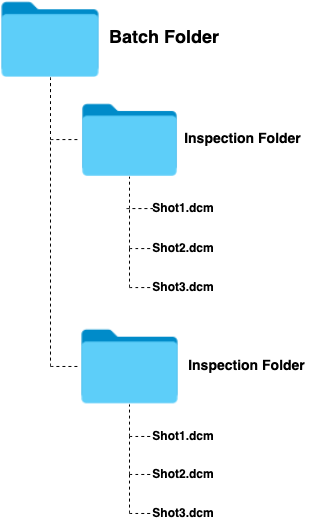
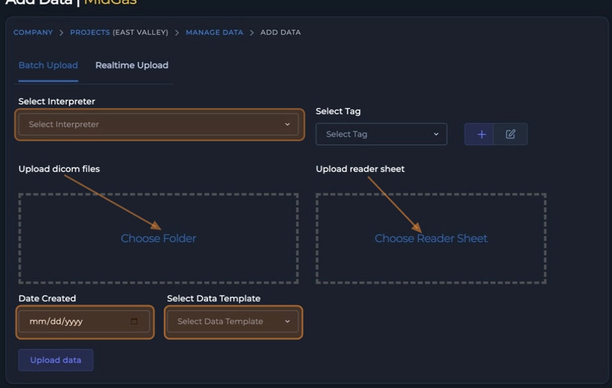
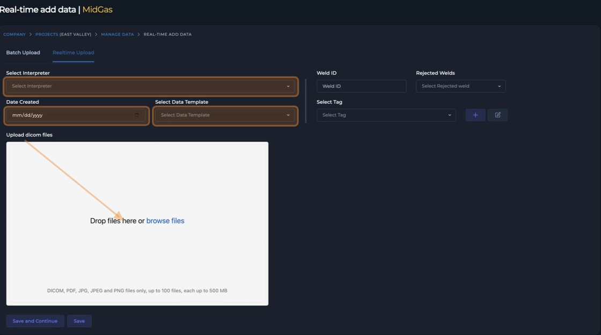
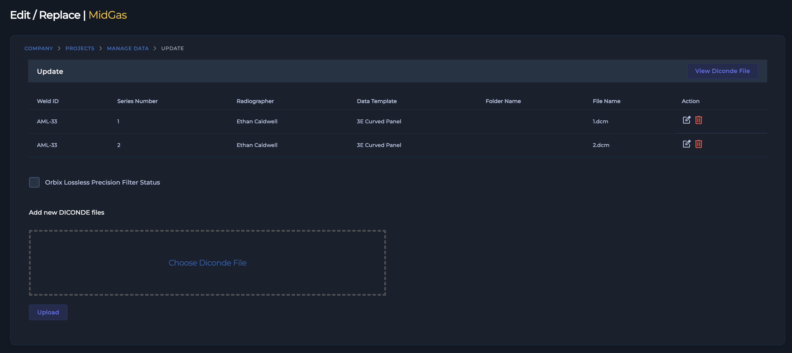
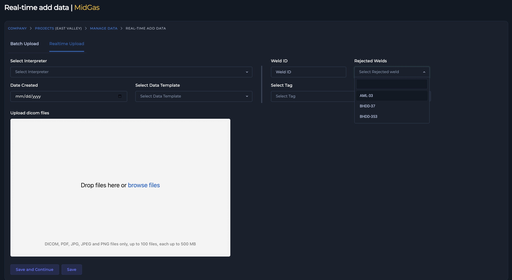
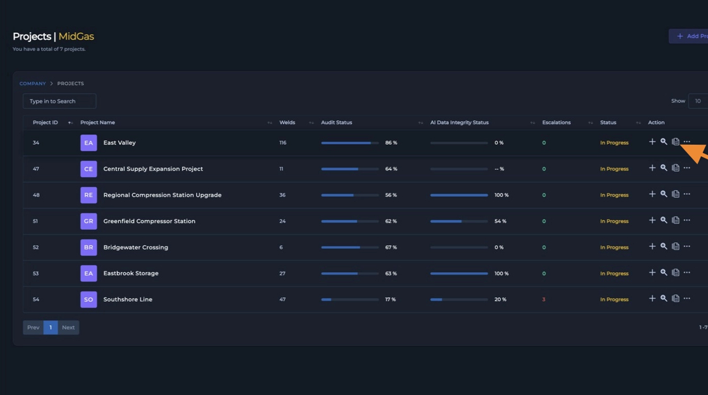
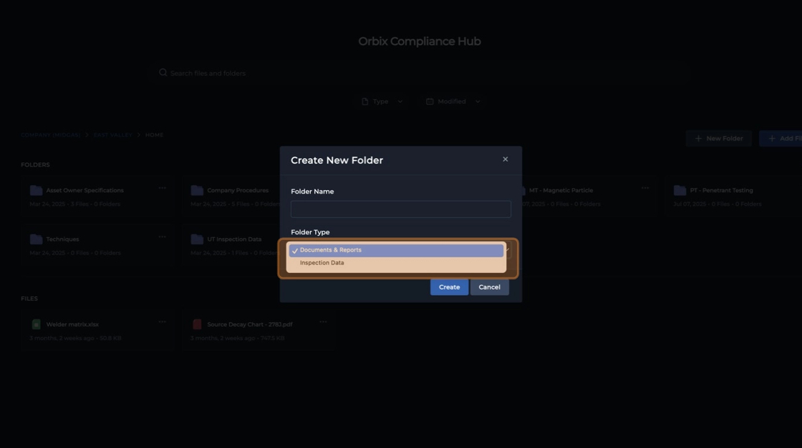
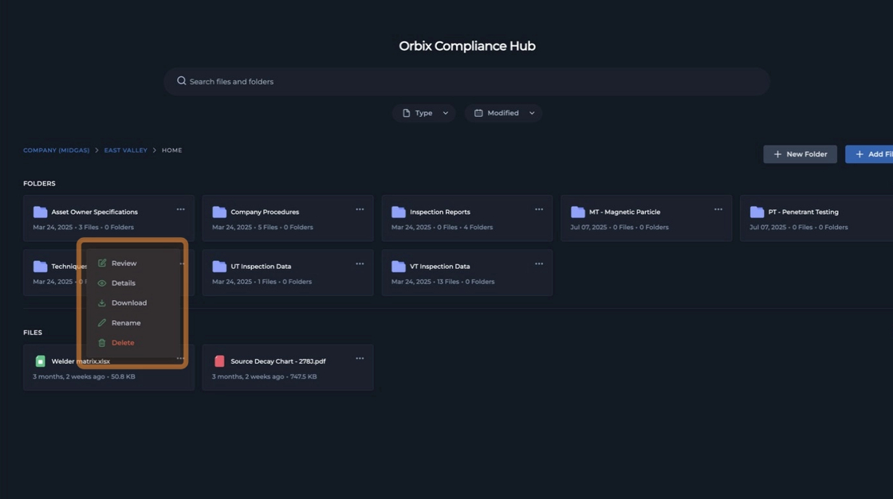

# **2.1 Uploading & Submitting Data**

The Orbix platform provides clear and flexible workflows for submitting all NDT project data. This section details the primary methods for uploading your inspection information, whether you are submitting Radiographic Testing (RT) data through our structured **DICONDE** workflows or managing other NDT methods and project files through the **Compliance Hub**.

## **2.1.1 Understanding Data Types in Orbix**

The Orbix platform is designed to handle various digital inspection workflows. It's key to understand the main data formats and how they are managed within the system.

* **Radiographic Data (DICONDE):** In our platform, radiographic data is typically supported through the **DICONDE** format. These are `.dcm` files that ensure the interoperable submission and transmission of RT data. You can submit this data using two dedicated workflows: **Batch Uploads** or continuous **Real-Time** submissions throughout the day.

* **Other Supported Formats:** We also support other NDT methods, including VT, UT (HDF5), Eddy Current, and Acoustic Emissions. Data for these methods, along with all standard file formats like PDFs, JPEGs, PNGs, Excel files, .csv files, and TIFs, is uploaded and managed through the **Compliance Hub**.

For detailed instructions on submitting these formats, please see the article: [*Section 2.1.4 Non-RT Method: Uploading to the Compliance Hub*](upload-submit-data.md#214-non-rt-method-uploading-to-the-compliance-hub).

## **2.1.2 RT Method 1: Batch Upload**

The Batch Upload method is ideal for submitting a large volume of inspection data at one time, such as at the end of a shift or a full day's work. This method allows you to upload an entire set of **DICONDE** files along with their corresponding examination report in a single operation.

### **2.1.2.1 (CRITICAL) Preparing Data for Batch Upload**

A precise folder structure is **essential** for a successful batch upload. Orbix uses this structure to automatically read and organize your data. Before uploading, arrange your files on your local machine exactly as follows:

1.  Create a single parent folder (e.g., `ProjectName_YYYY-MM-DD`). (You can use anyname you like.)
2.  Inside the parent folder, create a separate subfolder for **each unique Inspection ID**. Name the subfolder with the exact **Inspection ID**.
3.  Place all **DICONDE** files (`.dcm or.DCM`) corresponding to a single inspection inside its respective **Inspection ID** subfolder.

**Example Structure:**

    Batch_Upload_2025-07-03/
    ├── WELD_001/
    │   ├── Shot_01.dcm
    │   └── Shot_02.dcm
    └── WELD_002/
        └── Shot_01.dcm

{: style="height:300px"}

Adhering to this structure is the most critical step to ensure your data is processed correctly.

### **2.1.2.2 Best Practices for File Naming**

While the folder structure is the primary method for organization, consistent file naming is a best practice. If your workflow does not assign specific names, a simple convention like `Shot_01.dcm`, `Shot_02.dcm`, etc., within each **Inspection ID** folder is recommended.

For advanced workflows, Orbix can use the "Trusted Data" option, which relies on the embedded Study, Series, and Instance tags within the **DICONDE** files themselves. However, when in doubt, always default to the **Folder Structure** method.

### **2.1.2.3 Step-by-Step Guide**

To perform a batch upload:

1.  Navigate to the upload screen. You can do this in two ways:
    * From the **Projects** page, find your project and click the **Add Data** action icon.
    * Navigate into your project's **Main Data Manager** and click the **Add Data** button.
2.  You will be directed to the **Batch Upload** page.
3.  Complete the required fields:
    * **Interpreter:** Select the technician who performed the inspection.
    * **Inspection Date:** Select the date from the examination report.
    * **RT Report:** Drag and drop or browse to upload the corresponding examination report (e.g., PDF).
    * **Data Template:** Select the option that matches your data preparation.
        * If your specific inspection equipment is listed, select it.
        * Otherwise, select **Folder Structure**.
4.  Drag and drop your single parent folder (containing all the **Inspection ID** subfolders) into the designated upload area.
5.  Click **Upload Data**. Orbix will begin processing the batch.

{: style="height:300px"}

**Note:** If your total batch upload size exceeds two terabytes (2 TB), you must first compress the parent folder into a single `.zip` file before uploading.

## **2.1.3 RT Method 2: Real-Time Upload**

### **2.1.3.1 Overview**

The Real-Time Upload method is designed for workflows where inspection data must be submitted continuously for immediate review by remote auditors or inspectors. This provides a live feed of inspection progress and allows for rapid feedback cycles. Use this method when immediate submission is required, as opposed to end-of-day batching.

### **2.1.3.2 Submitting Data & Decisions**

To submit an inspection in real-time:

1.  From the **Main Data Manager**, navigate to the **Add Data** screen and select the **Real-Time** tab.
2.  Select the **Technician(s)** for the job.
3.  Enter a unique **Inspection ID** for the component being inspected.
4.  Drag and drop the corresponding **DICONDE** file(s) for that **Inspection ID** into the upload area.
5.  Click **Save and Continue**.

The inspection is immediately submitted to the system. You can track the status of all submissions (Pending, Accepted, Rejected) in the real-time dashboard. For more information, please see the article: *Understanding the Real-Time Submission Dashboard*

{: style="height:300px"}

### **2.1.3.3 Mapping Repairs**

When an inspection is rejected, you must link the new repair data to the original inspection to maintain a complete and traceable record. Orbix provides two methods to accomplish this.

**Method 1: From the Main Data Manager**

Use this method to add repair data to an existing rejected inspection.

1.  Navigate to the **Main Data Manager**.
2.  Locate the rejected **Inspection ID** that has been repaired.
3.  Click the **More Options** icon (three dots) in the **Actions** column for that inspection.
4.  From the menu, select **Edit Inspection**.
5.  In the **Edit Inspection** window, drag and drop the new **DICONDE** file for the repair into the designated repair upload box.

[Screenshot: The 'Edit Inspection' view, highlighting the drag-and-drop area for repair data.]
{: style="height:300px"}

**Method 2: During Real-Time Upload**

Use this method when submitting a new inspection that you know is a repair for a previously rejected item.

1.  Navigate to the **Real-Time** upload tab.
2.  As you fill out the submission details, locate the **Repair** dropdown menu.
3.  Click the dropdown to see a list of rejected **Inspection IDs**.
4.  Select the rejected **Inspection ID** to which this repair corresponds.
5.  Upload your new inspection data as usual. The link will be created automatically upon submission.

{: style="height:300px"}

## **2.1.4 Non-RT Method: Uploading to the Compliance Hub**

In addition to managing real-time and batch Radiographic Testing (RT) workflows with **DICONDE** files in the **Main Data Manager**, the Orbix platform enables the submission of other NDT methods through the **Compliance Hub**. The **Compliance Hub** is an intelligent repository where your data is mapped directly to your project and the underlying **Inspection ID**. It acts as a centralized hub for all your inspection information, data, and project documentation, providing robust version control, validation, action traceability, and a complete decision history.

### **2.1.4.1 What it's for**

The **Compliance Hub** is designed for submitting inspection data and reports for a variety of NDT methods, including:

* Magnetic Particle Testing (MT)
* Penetrant Testing (PT)
* Ultrasonic Testing (UT)
* Visual Testing (VT)
* Acoustic Emission Testing (AET)
* Eddy Current Testing (ECT)

Beyond raw inspection data, the **Compliance Hub** is the designated location for all project documentation. This allows you to store and manage critical files like end-user specifications, service company procedures, personnel qualification records (PQRs), and final examination reports. Each uploaded file is mapped directly to your project, ensuring a complete, traceable, and auditable record.

### **2.1.4.2 Accessing the Compliance Hub**

To navigate to the **Compliance Hub** for your project:

1.  From the main dashboard, navigate to the **Projects Page**.
2.  Locate the desired project in the list.
3.  In the **Actions** column for that project, click the **Compliance Hub** icon, which is represented by a stack of papers.

 

> {: style="height:300px"}
>
> **Image Description:** The **Projects Page** in Orbix. A list of projects is shown in a table. The mouse cursor is highlighting the **Compliance Hub** icon (a stack of papers) in the **Actions** column for a specific project.

 

This action will open the project-specific **Compliance Hub**, where you can begin managing your files.

### **2.1.4.3 Recommended Folder Structure**

An organized folder structure is essential for maintaining data integrity and accessibility. You can create folders in a way that best suits your project workflow. For optimal organization, we recommend the following practices:

* **Create one folder per NDT Method:** Establish separate folders for MT, PT, UT, etc., to keep inspection data clearly segregated.
* **Organize by Document Type:** Create folders for `Specifications`, `Procedures`, and `Examination Reports` to keep them separate from raw inspection data.
* **Create folders per Technician:** On larger projects, organizing folders by the responsible technician can help streamline reviews and tracking.

 

> {: style="height:300px"}
>
> **Image Description:** The main folder view within the **Compliance Hub**. Several folders are displayed, demonstrating a best-practice structure. Folder names include `MT - Magnetic Particle`, `PT - Penetrant Testing`, `Procedures`, and `Specifications`. The **New Folder** button is visible in the top right.

 

### **2.1.4.4 Step-by-Step: Uploading Files**

Follow these steps to create folders and upload your inspection files.

**1. Create a Folder:**

1.  Click the **New Folder** button.
2.  In the dialog box, enter a descriptive folder name.
3.  Select a **Folder Type** from the dropdown menu:
    * **Inspection Data:** Choose this for uploading data from NDT methods like VT, PT, MT, and ECT.
    * **Documents and Reports:** Choose this for supplementary project files such as specifications, procedures, reports, PDFs, and spreadsheets.
4.  Click **Create**.

{: style="height: 300px"}

**2. Upload Inspection Files:**

1.  Navigate into the folder you created.
2.  Drag and drop your files (e.g., PDFs, images, documents) directly into the main window to upload them.

**3. Manage Uploaded Files:**

Once a file is uploaded, you can access management options by clicking the three-dot icon on the right of the file name.

{: style="height: 300px"}

[Screenshot: A file shown in the Compliance Hub with the three-dot action menu open, highlighting the list of options: Review, Details, Download, Rename, and Edit.]

* **Review:** Allows auditors and other stakeholders to provide traceable feedback, flag samples, and agree or disagree with field decisions. All review activity is stored with the data.
* **Details:** Displays file metadata, including file type, size, who uploaded it, and when. It also contains a complete, time-stamped activity log for that specific file.
* **Download:** Downloads a copy of the file to your local system.
* **Rename:** Allows you to change the file name.
* **Edit:** Provides options to modify file information.

All data within the **Compliance Hub** can be easily downloaded, reviewed, and tracked, providing a complete database of all activity related to your project's inspection data.

## 2.1.5 Editing Uploaded RT Inspection Data

## 2.1.6 RT Interoperability Guides & FAQs

### 2.1.6.1 System-Specific Guides

### 2.1.6.2 Common Problems

#### Problem: Proprietary filters are not showing

#### Problem: Text annotations are missing