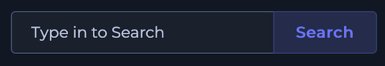
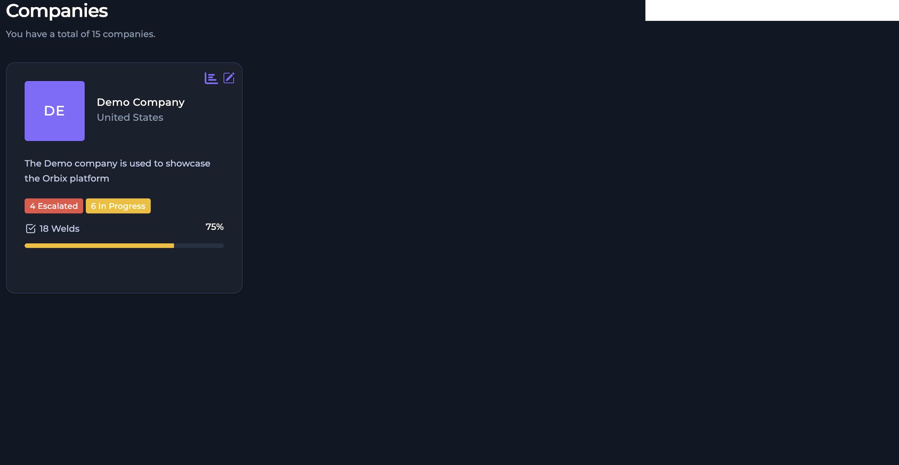
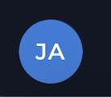
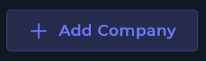
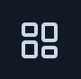

# Logging In & Your Dashboard

<iframe src="https://scribehow.com/embed/How_to_Log_In_for_the_First_Time__P7WqzzyWQUOPszqU2p1McQ?as=video" width="100%" height="800" allow="fullscreen" style="aspect-ratio: 16 / 12; border: 0; min-height: 480px"></iframe>

## Your Dashboard

| Number | Name | Function | Component |
| :---------: | :-------: | :---------: | :--: |
| 1 | Navigation Menu | Main site navigation | {: style="height:300px"} |
| 2 | Notifications Dialog | Dialog to check users notificaitons and alerts |  |
| 3 | Search Bar | Search bar used to preform site wide search |  |
| 4 | Company List | Shows the list of companies within an organization or that the user is assigned to |  |
| 5 | Orbix Profile Panel | Panel to navigate to user profile settings and admin dashboard |  |
| 6 | Add Company | Used to add a new company to organization |  |

## Navigation Menu

| Navigation Icon | Function | Component |
| :-----: | :-----: | :------: |
| Dashboard | Link to Company Dashboard showing Welds per Compant, Flagged Welds for Review, and Escalated Welds per Company |  |
| Your Companies | Link to Client List to view projects and welds associated with each client |  |
| Certifications | Link to Certifications Dashboard to view and manage  |  |